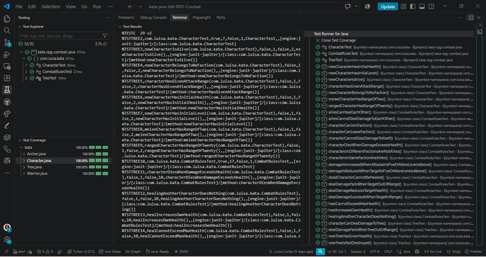
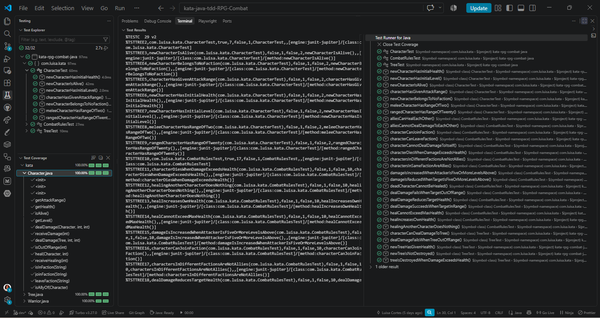
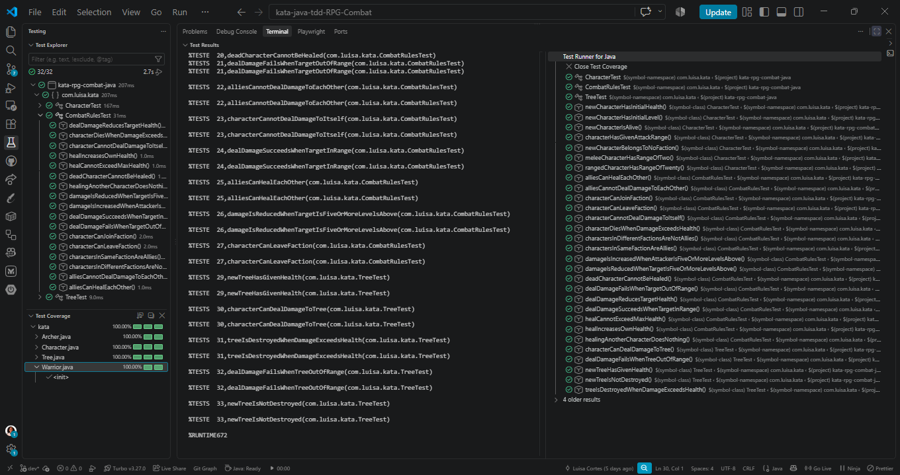
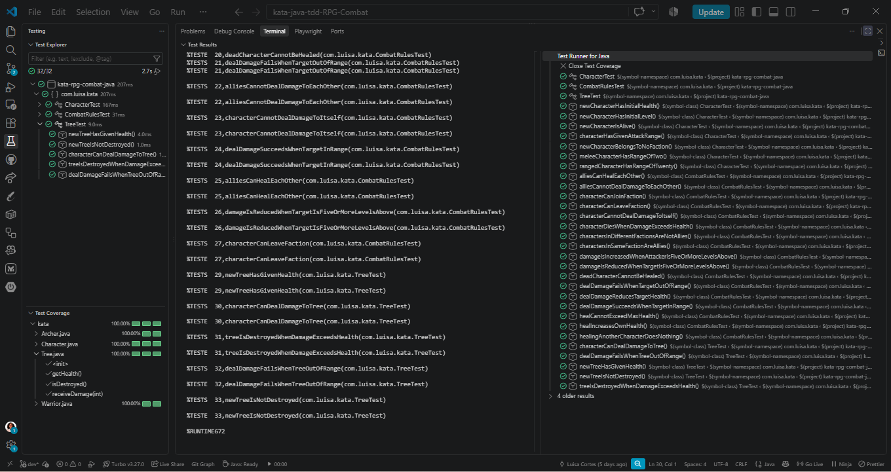

# Kata RPG Combat

🔗 [Repositorio en GitHub](https://github.com/lcortes89/kata-java-tdd-RPG-Combat)

Kata para practicar TDD (Test-Driven Development) este ejercicio consiste en implementar reglas de combate de un juego de rol (RPG): donde se tienen personajes con vida, nivel y facciones, que pueden hacerse daño, curarse, y atacar objetos como árboles. Implementado en Java 21 con JUnit 5, siguiendo el ciclo rojo-verde-refactor en cada regla, y organizado en ramas Git por funcionalidad.

[](https://www.oracle.com/java/technologies/downloads/) [](https://maven.apache.org/) [](https://junit.org/junit5/) [](https://www.jacoco.org/jacoco/)

<a id="index"></a>

# 📑 Índice

- [📖 Descripción](#description)
- [✨ Funcionalidades](#features)
- [🗺 Iteraciones implementadas](#iterations)
- [🛠 Tecnologías](#technologies)
- [📦 Pre-requisitos](#prerequisites)
- [⚙ Instalación](#installation)
- [▶ Uso](#usage)
- [🧪 Tests y cobertura](#testing)
- [📂 Estructura del proyecto](#structure)
- [👩‍💻 Autora](#author)

<a id="description"></a>

## Descripción

Este proyecto cosnta de 5 iteraciones del kata clásico de "RPG Combat", usado para practicar TDD. El dominio no incluye gráficos: solo la lógica de personajes (`Character`), sus variantes de combate cuerpo a cuerpo y a distancia (`Warrior`, `Archer`), y objeto (`Tree`). Cada regla del enunciado se desarrolló escribiendo primero el test (fase roja), luego el código mínimo para pasarlo (fase verde), y refactorizando cuando fue necesario.

[↑ Índice](#index) • [Funcionalidades →](#features)

<a id="features"></a>

## Funcionalidades

- Personajes con vida (1000 inicial), nivel (1 inicial) y estado vivo/muerto.
- Sistema de daño y curación, con reglas de límites (vida no baja de 0, no sube de 1000).
- Restricciones de combate: un personaje no puede dañarse a sí mismo, y solo puede curarse a sí mismo (o a sus aliados).
- Modificador de daño según diferencia de nivel entre atacante y objetivo (±50%).
- Rango de ataque: `Warrior` (cuerpo a cuerpo, rango 2) y `Archer` (a distancia, rango 20), como subclases de `Character`.
- Sistema de facciones(aliados): los personajes pueden unirse/salir de facciones, y los miembros de la misma facción son aliados (no se dañan entre sí, sí se curan entre sí).
- Objetos neutrales (`Tree`): reciben daño y pueden ser destruidos, pero no pertenecen a facciones, no atacan ni se curan.
- 29 tests unitarios con JUnit 5, organizados por tema en tres clases de test (CharacterTest.java, CombatRules.java, TreeTest.java), con cobertura verificada automáticamente por JaCoCo en cada `mvn test`.
- Historial Git organizado en una rama por funcionalidad (`feat/...`), todas integradas en `dev`.

[← Descripción](#description) • [↑ Índice](#index) • [Iteraciones implementadas →](#iterations)

<a id="iterations"></a>

## Iteraciones implementadas

**Iteración 1 — Estado inicial, daño y curación**
Los personajes nacen con 1000 de vida, nivel 1 y vivos. Pueden hacerse daño entre sí (restando de la vida, y muriendo si la vida llega a 0), y curarse (sin poder curar a un muerto ni superar los 1000 de vida).
*Ramas: `feat/character-creation`, `feat/deal-damage`, `feat/heal`*

**Iteración 2 — Restricciones y modificador de nivel**
Un personaje no puede dañarse a sí mismo, y solo puede curarse a sí mismo. El daño se reduce 50% si el objetivo supera al atacante por 5 niveles o más, y aumenta 50% en el caso contrario.
*Ramas: `feat/no-self-damage`, `feat/heal-self-only`, `feat/level-damage-modifier`*

**Iteración 3 — Rango de ataque**
Los personajes tienen un rango máximo de ataque: cuerpo a cuerpo (2 metros) o a distancia (20 metros), modelado con las subclases `Warrior` y `Archer`. Fuera de rango, no se puede hacer daño.
*Rama: `feat/attack-range`*

**Iteración 4 — Facciones y aliados**
Los personajes pueden unirse o salir de una o más facciones (ninguna al nacer). Quienes comparten facción son aliados: no pueden dañarse entre sí, pero sí curarse.
*Ramas: `feat/factions`, `feat/allies`, `feat/ally-no-damage`, `feat/ally-heal`*

**Iteración 5 — Objetos neutrales (props)**
Los personajes pueden dañar objetos no-personaje con vida propia (por ejemplo, un árbol con 2000 de vida). Estos objetos no se curan, no atacan y no pertenecen a facciones; al llegar a 0 de vida, se destruyen.
*Rama: `feat/props`*

Adicionalmente, se refactorizó el diseño para eliminar duplicación y mejorar la legibilidad (constantes con nombre, constructores encadenados, subclases `Warrior`/`Archer` en vez de parámetros sueltos).
*Rama: `refactor/melee-fighters-ranged-design`*

[← Funcionalidades](#features) • [↑ Índice](#index) • [Tecnologías →](#technologies)

<a id="technologies"></a>

## Tecnologías

-  — Lenguaje de programación usado en el proyecto
-  — Gestión de dependencias y build
-  — Framework de tests unitarios
-  — Medición y verificación automática de cobertura de tests
-  — Editor usado para desarrollar el proyecto
-  — Lenguaje de marcado del README
-   — Control de versiones y alojamiento del proyecto


[← Iteraciones implementadas](#iterations) • [↑ Índice](#index) • [Pre-requisitos →](#prerequisites)

<a id="prerequisites"></a>

## Pre-requisitos

Antes de clonar y ejecutar el proyecto, necesitas tener instalado:

- [Java 21 (JDK)](https://www.oracle.com/java/technologies/downloads/#java21)
- [Maven 3.6.3 o superior](https://maven.apache.org/download.cgi)
- [Git](https://git-scm.com/downloads)

[← Tecnologías](#technologies) • [↑ Índice](#index) • [Instalación →](#installation)

<a id="installation"></a>

## Instalación

```bash
git clone https://github.com/lcortes89/kata-java-tdd-RPG-Combat.git
cd kata-java-tdd-RPG-Combat
```

[← Pre-requisitos](#prerequisites) • [↑ Índice](#index) • [Uso →](#usage)

<a id="usage"></a>

## Uso

Este proyecto no tiene una aplicación interactiva: es la realización de un kata de diseño y lógica, pensado para explorarse a través de sus tests. Para compilar el proyecto:

```bash
mvn clean compile
```

Para ver el comportamiento en acción, la forma recomendada es correr los tests (siguiente sección) o revisar directamente las clases `Character`, `Warrior`, `Archer` y `Tree` en `src/main/java/com/luisa/kata/`.

[← Instalación](#installation) • [↑ Índice](#index) • [Tests y cobertura →](#testing)

<a id="testing"></a>

## Tests y cobertura

```bash
mvn clean test
```

29 tests unitarios con JUnit 5, repartidos en tres clases según el tema que prueban:

- `CharacterTest.java` — estado inicial (vida, nivel, vivo, rango, facción vacía).
- `CombatRulesTest.java` — reglas de combate (daño, curación, auto-daño, aliados, modificador de nivel, rango).
- `TreeTest.java` — comportamiento de los objetos neutrales (`Tree`).

La cobertura se verifica automáticamente con JaCoCo en cada `mvn test`, con un mínimo del 70% exigido por el kata (alcanzado y superado, ya que se completaron las 5 iteraciones).

**Vista general (panel Testing de VS Code):**



**Detalle por clase de test:**

| CharacterTest | CombatRulesTest | TreeTest |
|:---:|:---:|:---:|
|  |  |  |

[← Uso](#usage) • [↑ Índice](#index) • [Estructura del proyecto →](#structure)

<a id="structure"></a>

## Estructura del proyecto

```
KATA-JAVA-TDD-RPG-COMBAT/
├── pom.xml
├── README.md
├── src/
│   ├── img/
│   │   ├── Test1.png
│   │   ├── TestCharacter.png
│   │   ├── TestCombatRules.png
│   │   └── TestTree.png
│   ├── main/java/com/luisa/kata/
│   │   ├── Character.java
│   │   ├── Warrior.java
│   │   ├── Archer.java
│   │   └── Tree.java
│   └── test/java/com/luisa/kata/
│       ├── CharacterTest.java
│       ├── CombatRulesTest.java
│       └── TreeTest.java
```

[← Tests y cobertura](#testing) • [↑ Índice](#index) • [Autora →](#author)

<a id="author"></a>

## Autora

**[Luisa Cortés](https://github.com/lcortes89)**

[← Estructura del proyecto](#structure) • [↑ Índice](#index)